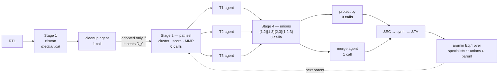

# HANDOFF — ASTRA path-portfolio addon

Context for whoever picks this up next, including me in a later session.

Branch `path-portfolio`, 19 commits ahead of `main`. **229 tests, all passing**,
none needing an EDA install or a model.

---

## 0. Status at a glance

| objective | state |
|---|---|
| 1 · Analyse RTL against timing constraints | done |
| 2 · Identify critical paths and violations | done |
| 3 · GenAI recommends optimisations | **2 of 4** — logic restructuring ✅, retiming ✅, pipelining ✗ (forbidden by the equivalence contract), FSM ✗ (testbed now exists, nothing run against it) |
| 4 · Evaluate timing / area / performance | done |
| 5 · Formally verify equivalence | **unbounded** on single-clock; **bounded, refute-biased** on multi-clock |
| 6 · Benchmark: 5 async domains, CDC, dividers, ~50K cells | **two built and timing**; neither can be *certified* at that size |

**The one-line summary:** the framework is complete and closes end to end. The
50K-cell benchmarks run correctly and reject bad candidates, but a bounded
equivalence check cannot confirm good ones at that scale — a limit of the
open-source solver, not unfinished work.

| design | clocks | cells | loop runs | SEC certifies | promotes |
|---|---|---|---|---|---|
| `mac_chain` | 1 | 7,343 | ✅ | ✅ unbounded `induction` | ✅ |
| `alu32` | 1 | 1,318 | ✅ | ✅ | ✅ (meets timing already) |
| `dual_path` | 1 | — | never synthesised | — | — |
| `dual_clock` | 3 (2 async) | 1,307 | ✅ | ✅ `bounded` | ✅ **proven end to end** |
| `soc_bench` | 13 (5 async) | 49,935 | ✅ | ❌ refutes only | ❌ |
| `netproc` | 13 (5 async) | 50,502 | ✅ | ❌ refutes only | ❌ |

---

## 1. How to make it work

### Setup, once

```bash
make build          # ~5–10 min; builds the Yosys + OpenSTA + nangate45 image
make doctor         # confirms tools, PDKs, and that every design resolves
```

On macOS the container runs under Colima. **It stops on its own** — it dropped
twice in one session here — and every EDA call then fails with
`failed to connect to the docker API at unix:///var/run/docker.sock`. The fix
is `colima start`; the image and designs survive.

### The two loops

They run **on the host** (so `claude` and its credentials are local) and
dispatch Yosys/OpenSTA **into the container** via `ASTRA_TOOL_PREFIX`. That
split is what `make opt` and `make portfolio` set up for you:

```bash
make opt       DESIGN=mac_chain  OPT_ARGS="--model haiku --iters 1"
make portfolio DESIGN=dual_clock PF_ARGS="--model haiku --iters 1"
```

Running `python3 tools/portfolio.py <design>` directly works too, but only if
you set `ASTRA_TOOL_PREFIX` yourself — otherwise it tries to run Yosys on the
host and fails with the docker-socket error above.

### Flow commands — no model, no API key, no tokens

```bash
make run   DESIGN=netproc                 # synthesis + STA
make syn   DESIGN=netproc                 # synthesis only
make scan  DESIGN=netproc                 # structural smells, no tools at all
make paths DESIGN=netproc RUN=<run-id>    # the targets worth an agent call
make list                                 # designs and runs, with each design's clocks
```

### Verify with no tools and no model

```bash
python3 tools/selftest.py     # 229 tests: no EDA, no model, no network
python3 tools/pathsel.py runs/mac_chain/opt-20260901-025558-run1/baseline -k 3
```

That `pathsel` invocation is the acceptance check for the novelty: on the
committed artifact it must collapse 20 paths to **one cone** and cut three
segments matching the three bottlenecks `mac_chain/config.json` declares by
hand — without reading that field. Its brief also names the capture clock.

### What to expect, per design

- **`mac_chain`** — the reference. Full loop, unbounded proofs, promotes.
  ~5 s synthesis. Use it to check nothing is broken.
- **`dual_clock`** — the multi-clock loop, closing. ~3 s synthesis, SEC proves
  in ~51 s at its declared `sec_depth: 6`. **This is the design that
  demonstrates multi-clock promotion.**
- **`soc_bench` / `netproc`** — the objective-6 benchmarks. ~45–125 s
  synthesis. Selection, scoping, protection and diagnosis all work; SEC times
  out or is OOM-killed rather than certifying, so nothing is promoted. Expected,
  not a bug — see §5.

### Before comparing two runs

- **Reset the skill library between arms** (`make clean-skills`). It persists
  across runs by design, so the second arm otherwise inherits the first's
  learning. For a throwaway run point it elsewhere: `--skills /tmp/x.json`.
- **Match `--iters`.** The loops ship different defaults (3 for `make opt`,
  4 for `make portfolio`), so omitting it compares budgets, not methods.
- **Do not run with `--clean 0`.** The pre-synthesis stage takes the obvious
  fix off the table, which is what forces the specialists onto *different*
  bottlenecks. Without it they converge and the unions collapse to the parent.
- **`--dry-run` still needs the container.** It skips model calls, not tools.

---

## 2. What this repo is

A container (Yosys + OpenSTA + nangate45) with two closed-loop RTL timing
optimisers built on it.

**`make opt` — Dr. RTL.** The published loop: analyse the critical path, write
N rewrites in parallel, verify each for equivalence, keep the best by a scalar
PPA objective, learn from the group. Four roles kept strictly apart — the agent
that decides never runs a tool, the evaluator never interprets a report.

**`make portfolio` — the addon.** Same skeleton, three changes: a mechanical
selector picks *k disjoint* bottleneck targets instead of handing all N
candidates one shared analysis; one agent is scoped to each; their fixes are
recombined by text splicing before measurement picks the winner.



---

## 3. Files

| file | lines | what it owns |
|---|---|---|
| `tools/pathsel.py` | 1253 | **the novelty** — cone clustering, criticality distribution, value scoring, MMR selection, path segmentation |
| `tools/portfolio.py` | 1240 | the addon orchestrator; subclasses `drrtl.Orchestrator` |
| `tools/drrtl.py` | 1356 | base loop, four agents; **do not fork it, subclass it** |
| `tools/rtlscan.py` | 738 | pre-synthesis structural smells, lexical (no elaboration) |
| `tools/rtl_map.py` | 611 | path → RTL localisation, structural diagnosis |
| `tools/skills.py` | 552 | the confidence-weighted library |
| `tools/skillgen.py` | 689 | renders `SKILL.md`, routes sections per agent role |
| `tools/clocks.py` | 425 | the clock model — periods, groups, SDC generation. **Stdlib only, imports nothing from this tree** |
| `tools/score.py` | 419 | Eq. 1/3/4/5, `sec_tally`, `timing_in_cycles` |
| `tools/merge.py` | 337 | order-independent mechanical union + conflict report |
| `tools/sec.py` | 315 | SEC driver — single-clock miter, multi-clock `clk2fflogic` |
| `tools/protect.py` | 223 | what the optimiser may not touch, enforced **before** SEC |
| `tools/selftest.py` | 2520 | 229 tests, no EDA, no model |

Reuse rule: `portfolio.py` subclasses `drrtl.Orchestrator`, so evaluation, SEC,
scoring, skill learning, the trajectory log and the reply parsers all come
across unchanged.

---

## 4. Measured results

Haiku, `mac_chain`, 2 ns target. Eq. 3 is relative to D_0; lower is better.

| run | iters | calls | ΔWNS | ΔTNS | Eq.3 | SEC |
|---|---|---|---|---|---|---|
| Dr. RTL | 3 | 18 | **+54.7 %** | +58.7 % | −0.4789 | 11/12 |
| portfolio | 2 | 11 | +53.5 % | +56.7 % | −0.4658 | 4/6 |
| portfolio (ext.) | 3 | 5 | +47.1 % | **+79.8 %** | **−0.5153** | 3/3 |
| portfolio, 1 iter | 1 | 6 | +52.8 % | +56.0 % | −0.4599 | 3/3 |
| portfolio, post-fix | 1 | 6 | +53.5 % | +56.7 % | −0.4658 | 3/3 |

**`dual_clock`, Haiku, 1 iteration** — the multi-clock loop closing end to end:

| metric | D_0 | best | change |
|---|---|---|---|
| WNS | −0.0523 | **+0.3994** | VIOLATED → **MET** |
| TNS | −0.6798 | 0.0000 | all violations gone |
| area | 2620.63 | 2565.30 | −2.1 % |
| Eq. 3 | 0.0000 | **−3.8139** | |

SEC 3/3 specialists, 1/1 unions, all `bounded` with every clock free.

**`netproc`, Haiku, 1 iteration** — the run that settled the scale question:

| | |
|---|---|
| protection gate | 3/3 passed |
| specialists | all three found the same bottleneck: "512-bit parity as serial XOR chain" |
| SEC | t1 timed out at 420 s; **t2 and t3 OOM-killed** (exit 137) |
| promoted | nothing |

### Read all of these carefully

- **Every run peaked at iteration 1.** No iteration 2 or 3 has improved on it
  in any portfolio run. One early Opus run is the sole counterexample.
- **The merge agent has never earned its call.** Measured delta against the
  free mechanical union: `+0.0000` on every run.
- **On `dual_clock` the specialists contributed nothing.** The whole gain came
  from the pre-synthesis cleanup agent; all three specialists returned
  candidates *identical* to that parent and reported a verdict rather than a
  transformation. The run proves the multi-clock plumbing, not the novelty.
- **Cone selection has never fired** in any measured run. `soc_bench` reports
  26 cones and `netproc` 32, so they are the first designs that could exercise
  it — but neither can promote, so nothing has been measured through it.

---

## 5. The scale limit, and the traps around it

### Bounded SEC cannot certify at 50K cells

| design | broken candidate | equivalent candidate |
|---|---|---|
| two-domain toy, no arithmetic | refuted 0.3 s | **proved 0.5 s** |
| `dual_clock`, depth 6 | refuted 3 s | **proved 51 s** |
| `soc_bench`, 24 multipliers | refuted 21–40 s | timed out 1800 s; OOM at depth 5 |
| `netproc`, 512-deep XOR chain | — | timed out 420 s; OOM |

`netproc` was built without multipliers precisely because multipliers stop
`soc_bench` being certified. **That premise was insufficient.** Deep parity is
the classic hard case for a resolution-based SAT solver, every bit as bad as a
multiplier. The general form: the miter proves *every* output equivalent
regardless of which line changed, so **tractability is a property of the whole
design, not of the edit**. There is no rewrite-local escape.

`eqy`, which partitions and would scale further, is **absent from the image** —
`/etc/astra-tools.txt` records `eqy=unavailable`, so its build failed silently
when the image was made. `make build EQY=1` is the first thing to try.

### A bounded pass is worth exactly what its depth can see

**The sharpest edge in the project**, and nothing checks it automatically.
Measured on `dual_clock`, whose candidate had a genuine functional bug:

| depth | steps | broken candidate | equivalent candidate |
|---|---|---|---|
| 4 | 8 | **reported equivalent** — false pass, 3 s | proved, 2 s |
| 6 | 12 | refuted, 3 s | proved, 51 s |
| 8 | 16 | refuted, 5 s | no verdict in 300 s |

One step too shallow and the check is vacuous; two too deep and it never
finishes. A depth tuned until proofs close is a depth tuned until they are
*vacuous*. A cap was implemented, measured, and removed; a test guards against
reintroducing it. Designs record the depth their author verified (`sec_depth`
in `config.json`).

---

## 6. Defects found and fixed

Each was the instrument being wrong, not the method. Worth reading before
trusting any number in a summary.

| defect | symptom | fix |
|---|---|---|
| SEC counted `passed/attempted` | a run where 6 of 9 model calls **died** reported "33 % SEC" when 3 of 3 real candidates passed | `score.sec_tally` counts over *decided* |
| library fragmented its evidence | one concept split into 4 entries, one keyed on a **verdict**; an agent declined a transformation whose own mean advantage was favourable | prefix token matching, containment, strategy floor, verdicts barred from founding an entry |
| `criticality` gated on `slack < 0` | every target in a design that **meets** timing scored 0.0 | `severity()`, monotone across zero |
| skill doc exceeded its budget | catalogue silently truncated before any agent saw it | budget fits the document; per-role routing |
| segmentation ≠ RTL separability | with `--clean 0` all 3 agents made the *same* edit | the pre-synthesis stage forces divergence — **do not disable it** |
| one period for every clock | paths in four of five domains normalised against the wrong number, **silently mis-ranked** | `tools/clocks.py`; each path uses its own clock's period |
| `criticality` compared slack across async domains | "which path limits *the* clock" presupposes one clock | works in **cycles of each path's own clock** |
| Eq. 3's TNS summed nanoseconds across domains | a 32 ns domain counted 16× a 2 ns one for the same fraction of budget lost | `score.timing_in_cycles` |
| the protection gate froze whole lines | rejected all three specialists for the **exact fix the design asks for**, because the line also *read* a CDC signal | protect assignments; require references to survive |

**Two process warnings.**

1. Edits made via shell heredocs were written, verified, then reverted before
   staging — one commit's message described a change its diff did not contain.
   Verify with `git show HEAD:<file>` after committing.
2. A commit (`c5cf639`) was made outside this workflow whose message
   misdescribes `protect.py` as a "path-protection tool — freeze critical paths
   across flow re-runs". It is not; it protects CDC and clock-generation RTL.
   The diff is correct; the message is not.

---

## 7. Things that will bite you

- **CLI failures are the dominant confound.** `claude ... exit 1` with empty
  stderr has cost whole iterations. Check `not_generated` in the SEC tally
  before concluding anything about a run.
- **Colima stops on its own.** See §1.
- **A safety rule that blocks the fix is broken, not conservative.** The
  protection gate's first version froze any line *mentioning* a protected
  identifier and rejected the optimisation it existed to permit. "Blunt is
  safe" was wrong.

### Writing a multi-clock SDC — four things that cost an afternoon each

All found building `soc_bench`, all failing loudly but uninformatively.

- **`get_ports {foo[*]}` does not work.** OpenSTA 3.1.0 reads the bus subscript
  as an integer and dies with a bare `Error: stoi` — no line number, no port
  name. Select ports by walking `[all_inputs]` and matching in Tcl;
  `soc_bench.sdc`'s `astra_ports` proc is the pattern. A loose glob is not a
  fix: `sys_a*` also matches `sys_acc[0]`.
- **An instance name containing `[` is unusable in SDC**, same reason. This
  constrains the *RTL*: `autoname` names a cell after a net in its fan-in cone,
  so a divider written `clk_r <= cnt[1]` becomes `dsp_div_cnt[1]_DFFR_X1_D`
  and no generated clock can hang on it. A **pure toggle flop**
  (`clk_r <= ~clk_r`) has no such cone.
- **Do not guess a generated clock's pin — read it.** Names are deterministic
  but unintuitive: the ÷4 flop comes out as `clk_dsp_div2_r_DFFR_X1_CK`, named
  after its *clock* net. Synthesise once and parse the netlist for whatever
  drives the divided net.
- **A generated clock's `-source` is a pin, not a port**, once its source is
  itself generated. Symptom: `port '...' not found`.

Also: `@ASTRA_CLOCK_DEFS@` is **not** substituted inside `#` comments, so
documenting the placeholder in a header is safe. It was not at first — the
multi-line expansion uncommented fourteen lines of Tcl.

---

## 8. What is left

In rough order of value:

1. **`make build EQY=1`.** The one plausible route to certifying a 50K-cell
   design. Everything else about objective 6 is done.
2. **Run the specialists somewhere they can contribute.** They have never
   beaten the cleanup agent on a multi-clock design. `dual_clock` promotes but
   the specialists added nothing; the benchmarks cannot promote at all. Until
   one of those changes, the addon's central claim is unmeasured on multi-clock.
3. **FSM optimisation.** `soc_bench` and `netproc` both carry a 7-state framer,
   so objective 3's missing half finally has a testbed. Nothing has been run
   against it, and the skill document still tells agents they are unreliable at
   FSM work on published evidence — now testable rather than untestable.
4. **Per-domain synthesis targets.** `abc -D` takes the tightest period across
   all clocks, so slow domains are over-constrained and may show inflated area.
   Fine while it is reported; not fine if area becomes a headline number.
5. **`designs/dual_path/`** has still **never been synthesised**. It is the
   two-independent-cone testbed objective-2 work needs.

Detail for 1–4 lives in `docs/multi-clock.md` and
`docs/equivalence-contract.md`. Read the contract before touching anything that
decides whether a candidate is promotable.

---

## 9. Navigating the code — graphify

The repo is indexed as a queryable code knowledge graph. Local AST parsing via
tree-sitter: no LLM, no network, no vector store, no API key.

```bash
graphify update .                          # rebuild (seconds)
graphify explain "pathsel"                 # a node, its neighbours, why each edge exists
graphify path "portfolio.py" "score.py"    # shortest path between two nodes
```

Current index: **1096 nodes, 1892 edges, 60 communities**. `runs/` is not
indexed, so the run artifacts add no noise.

`GRAPH_REPORT.md`, `graph.json` and `graph.html` are **tracked**, so the graph
is browsable from GitHub without a local install. The rebuild cache and dated
backups are not.

**They are derived, and go stale the moment code changes.** `GRAPH_REPORT.md`
records the commit it was built from — check that against `git rev-parse HEAD`
before trusting it. A rebuild that finds no topology change leaves the outputs
untouched *including that stamp*, so to refresh the stamp alone, delete the
three files and rebuild.

Structural findings worth carrying: `ClockSet` is now the second most-connected
abstraction, every "surprising connection" is still `pathsel.py →
rtl_map.RtlIndex` — the addon's single real coupling to the base flow — and
there are **no import cycles**. `tools/clocks.py` and `tools/protect.py` were
both made stdlib-only leaves so that adding five consumers each could not
create one.
