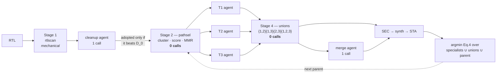
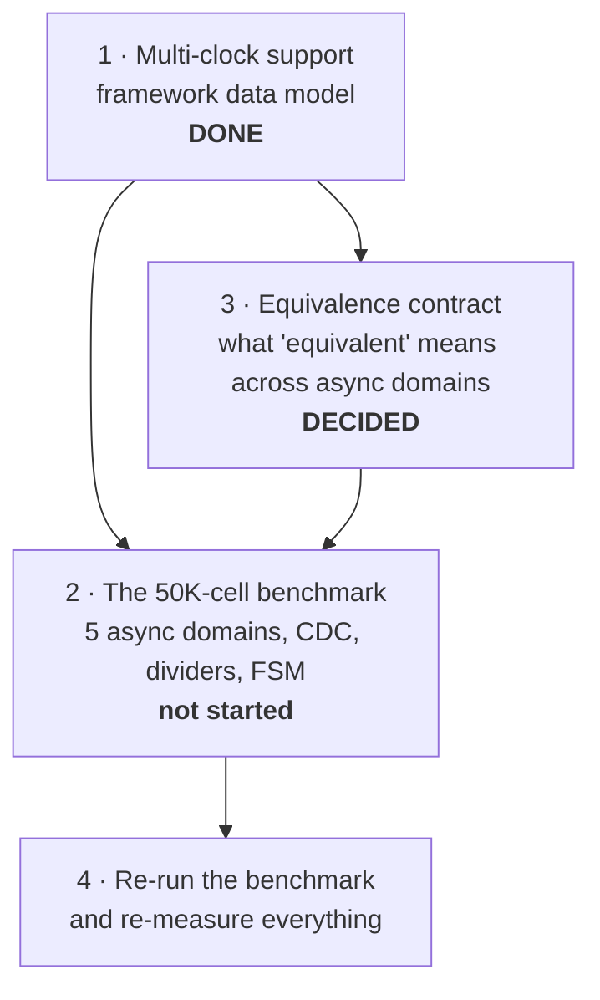

# HANDOFF — ASTRA path-portfolio addon

Context for whoever picks this up next, including me in a later session.

Branch `path-portfolio`. 251 tests, all passing, none needing an EDA install
or a model. `make opt`'s loop is unchanged; its optimiser prompt gained one
sentence asking agents to keep register names (see below).

**Since the last handoff: multi-clock SEC certifies.** The whole-design
`clk2fflogic` miter cost what the *design* cost, so a correct candidate on a
50K-cell benchmark timed out or was OOM-killed. Multi-clock SEC now runs
**register correspondence first** (`tools/regcorr.py`,
`flow/scripts/sec_regcorr.tcl`): registers are paired by name and cut open,
unchanged logic is settled by exact structural hashing, and only the edited
cone reaches `equiv_simple`. `alumacc` plus order-free `$macc` hashing does the
same for adder chains rebuilt as trees. All six real `netproc` parity rewrites
prove in **~8 s each**, unbounded, for every clock interleaving, and a cleanup
candidate that also rebuilt a 16-term 260-bit accumulate proves in 8.5 s;
thirteen deliberately broken cases across three designs all stay unproven
(`tools/secbench.py`). **All four Phase-4 designs now promote on a sound
verdict** — see "September 2026 runs" in §6.4, which also records one false
pass that was found, fixed and withdrawn. The bounded check is
kept as the fallback that refutes. The reasoning, the dead ends and the
measurements are in `docs/equivalence-contract.md` §2.

---

## 1. What this repo is

A container (Yosys + OpenSTA + nangate45) with two closed-loop RTL timing
optimisers built on it.

**`make opt` — Dr. RTL.** The published loop: analyse the critical path, write
N rewrites in parallel, verify each for equivalence, keep the best by a scalar
PPA objective, learn from the group. Four roles kept strictly apart — the agent
that decides never runs a tool, the evaluator never interprets a report.

**`make portfolio` — the addon.** Same skeleton, three changes: a mechanical
selector picks *k disjoint* bottleneck targets instead of handing all N
candidates one shared analysis; one agent is scoped to each; their fixes are
recombined by text splicing before measurement picks the winner.



---

## 2. Files

| file | lines | what it owns |
|---|---|---|
| `tools/pathsel.py` | 1237 | **the novelty** — cone clustering, criticality distribution, value scoring, MMR selection, path segmentation |
| `tools/portfolio.py` | 1222 | the addon orchestrator; subclasses `drrtl.Orchestrator` |
| `tools/rtlscan.py` | 738 | pre-synthesis structural smells, lexical (no elaboration) |
| `tools/merge.py` | 337 | order-independent mechanical union + conflict report |
| `tools/skillgen.py` | 436 | renders `SKILL.md`, routes sections per agent role |
| `tools/drrtl.py` | 1291 | base loop, four agents; **do not fork it, subclass it** |
| `tools/clocks.py` | 348 | the clock model — periods, groups, SDC generation. **Stdlib only, imports nothing from this tree**, so every consumer resolves a period the same way without a cycle |
| `tools/score.py` | 354 | Eq. 1/3/4/5, plus `sec_tally` and `critical_period` |
| `tools/skills.py` | 555 | the confidence-weighted library |
| `tools/rtl_map.py` | 611 | path → RTL localisation, structural diagnosis |
| `tools/protect.py` | 170 | what the optimiser may not touch, and the gate that enforces it **before** SEC |
| `tools/selftest.py` | 2475 | 225 tests, no EDA, no model |

Reuse rule: `portfolio.py` subclasses `drrtl.Orchestrator`, so evaluation, SEC,
scoring, skill learning, the trajectory log and the reply parsers all come
across unchanged. `drrtl.py` was changed only by three parameterisations (a
swappable system prompt and directive list, an explicit SEC gold, a run prefix)
and `rtl_map.py` by a `stage=` argument.

---

## 3. Measured results

Haiku, `mac_chain`, 2 ns target. Eq. 3 is relative to D_0; lower is better.
SEC counted over candidates that reached a verdict.

| run | iters | calls | ΔWNS | ΔTNS | Eq.3 | SEC |
|---|---|---|---|---|---|---|
| Dr. RTL | 3 | 18 | **+54.7 %** | +58.7 % | −0.4789 | 11/12 |
| portfolio | 2 | 11 | +53.5 % | +56.7 % | −0.4658 | 4/6 |
| portfolio (ext.) | 3 | 5 | +47.1 % | **+79.8 %** | **−0.5153** | 3/3 |
| portfolio, 1 iter | 1 | 6 | +52.8 % | +56.0 % | −0.4599 | 3/3 |
| portfolio, post-fix | 1 | 6 | +53.5 % | +56.7 % | −0.4658 | 3/3 |

**Multi-clock, `dual_clock`, Haiku, 1 iteration** — the run that showed the
loop closing end to end on more than one clock:

| metric | D_0 | best | change |
|---|---|---|---|
| WNS | −0.0523 | **+0.3994** | VIOLATED → **MET** |
| TNS | −0.6798 | 0.0000 | all violations gone |
| area | 2620.63 | 2565.30 | −2.1 % |
| Eq. 3 | 0.0000 | **−3.8139** | |

SEC 3/3 specialists and 1/1 unions, all `bounded` with every clock free.

**Read this one carefully too.** The whole gain came from the **pre-synthesis
cleanup agent** (`clean0`, adopted at −3.8139). All three specialists returned
candidates *identical* to that parent — same WNS to fifteen digits — and each
reported a verdict rather than a transformation ("No safe optimization
available within constraints"), which the library correctly refused to learn
from. So this run demonstrates that multi-clock selection, protection, SEC and
promotion work end to end. It does **not** show the specialists contributing
anything on this design.

**Read these carefully.** Three things are easy to over-claim:

- **Every run peaked at iteration 1.** No iteration 2 or 3 has improved on it
  in any portfolio run. The extended run's winning −0.5153 came from iteration
  1; its iterations 2 and 3 lost all six model calls to CLI failures. One early
  Opus run is the sole counterexample.
- **The merge agent has never earned its call.** Its measured delta against the
  free mechanical union is `+0.0000` on every run.
- **Cone selection has never fired** in any measured run. The two designs those
  runs used collapse to one cone, so all of it exercised *segmentation*.
  `soc_bench` reports **26 distinct cones**, so it is the first design that can
  exercise cone selection — but see §6.4 before reading anything into what it
  picks.

---

## 4. Defects already found and fixed

Each of these was the instrument being wrong, not the method. Worth reading
before trusting any number in a summary.

| defect | symptom | fix |
|---|---|---|
| SEC counted `passed/attempted` | a run where 6 of 9 model calls **died** reported "33 % SEC" when 3 of 3 real candidates passed | `score.sec_tally` counts over *decided*; both loops share it |
| library fragmented its evidence | one concept split into 4 entries at n=1–2, one keyed on a **verdict** (`"already attempted; insufficient margin"`); an agent declined a transformation whose own mean advantage was favourable | prefix token matching, containment alongside Jaccard, strategy floor, verdicts barred from founding an entry, `skills consolidate` |
| `criticality` gated on `slack < 0` | every target in a design that **meets** timing scored 0.0 and could not be ranked | `severity()`, monotone across zero, constraint at 0.5 |
| skill doc exceeded its budget | catalogue silently truncated away before any agent saw it | budget fits the document; per-role routing |
| segmentation ≠ RTL separability | with `--clean 0`, all 3 agents made the *same* edit; every hunk contested, union returned the parent | the pre-synthesis stage is what forces divergence — **do not disable it** |

**Process warning.** Two edits made via shell heredocs were written, verified
working, then reverted before staging — one commit's message described a change
its diff did not contain. Verify with `git show HEAD:<file>` after committing,
and prefer the edit tools over heredoc rewrites.

---

## 5. Objectives status

| # | objective | status |
|---|---|---|
| 1 | Analyze RTL against timing constraints | done |
| 2 | Identify critical paths and violations | done |
| 3 | GenAI recommends optimizations | **2 of 4** (FSM now has a testbed — `soc_bench`) |
| 4 | Evaluate timing / area / performance | done |
| 5 | Formally verify equivalence | **unbounded** on both: induction on single-clock, **register correspondence** (`regcorr`) on multi-clock; bounded `clk2fflogic` remains the multi-clock fallback for retimed candidates and for refutation — see `docs/equivalence-contract.md` §2 and the depth warning in §6.4 |
| 6 | Benchmark: 5 async domains, CDC, dividers, ~50K cells | **SEC certifies** on `netproc` (50,502 cells, 13 clocks) and `soc_bench` (49,935 cells) via `regcorr` in seconds when register names are kept — see §6.4 |

Objective 3 detail: logic restructuring ✅, retiming ✅, **pipelining ✗**,
**FSM optimization ✗**.

Pipelining is *actively forbidden* — `drrtl.py:424`, `portfolio.py:169`,
`SKILL.md:26` all state "you may not add or remove a pipeline stage". That is
not an oversight: adding latency breaks the sequential-equivalence gate every
candidate passes through. Allowing it means changing the verification contract,
not editing a prompt.

FSM optimization now **has** a testbed: `soc_bench`'s 7-state packet framer,
which Yosys's `fsm` pass extracts. It is still ✗ because nothing has been run
against it, and the skill document still tells agents they are unreliable at
FSM work, on published evidence. That claim is now testable rather than
untestable.

---

## 6. The upcoming work

Three pieces, in dependency order. **(1), (2) and (3) are now done** — the
framework, the benchmark design and the contract. What remains is running the
loop on it, which needs the SEC partitioner and a decision about
`criticality()` across async domains (§6.4).



### 6.1 Multi-clock support — DONE

Full detail in **`docs/multi-clock.md`**. Summary of what landed:

- `tools/clocks.py` — `Clock` / `ClockSet`. Accepts `clocks: [{name, port,
  period_ns, generated_from?, divide_by?}]`; a generated clock derives its
  period from `divide_by`. The singular `clock` object still loads and is kept
  as a one-element alias in both `config.json` and `metrics.json`, so the three
  shipped designs need no edit and no old reader gets `None`.
- SDC: `@ASTRA_CLOCK_DEFS@` generates `create_clock` /
  `create_generated_clock` per clock plus `set_clock_groups -asynchronous`
  across independent masters. `@CLK_PERIOD:<name>@` names one clock;
  `@CLK_PERIOD@` still means the primary.
- `sta_common.tcl` emits per-clock-group WNS/TNS/violating endpoints, bucketed
  by capture clock. `parse_sta.clock_groups()` carries them, and falls back to
  bucketing the reported paths by their `path_group` when the STA build cannot
  emit them — labelled `source: "reported"`, `complete: false`, because its TNS
  is a floor, not a total.
- **The trap is closed.** `PathFeatures.period_ns` is the period of the clock
  that captured *that* path. `severity()`, `criticality()` (whose sigma is a
  *fraction* of a period, so the absolute slop differs per domain) and
  `rtl_map.diagnose()` all use it. An unresolved group is reported in the
  selection artifact under `clocks.unresolved`, never silently defaulted.
- `score.critical_period()` scales Eq. 3 by the period of the group that owns
  the worst slack, falling back to the tightest clock.
- **Yosys `abc -D` targets the tightest period** (the decision §6.1 asked for).
  It never under-constrains; the cost is that slow domains are mapped against a
  target they did not need and may buy delay with area. `astra syn` prints the
  caveat on any multi-clock design. `ClockSet.synthesis_period` is the single
  place that decision lives.

**A bug this found in itself.** The first version of the group summary
converted `get_property <path> slack` from seconds, as `sta::worst_slack`
requires — but that property is already in library units, so every group number
came out 1e9 too large. `parse_sta._coerce`'s magnitude guard silently rescued
it at the scale being tested and would *not* have below 1 ps. Fixed, and
`parse_sta` now cross-checks the worst group slack against the design-wide WNS
(`agrees_with_design_wns`) so the next such disagreement reports itself instead
of waiting to be noticed.

Verified against real OpenSTA on `mac_chain`: WNS −0.3573 / TNS −3.7438 / 15
violating endpoints, group and design-wide numbers agreeing.

### 6.3 The equivalence contract — DECIDED

Written up in **`docs/equivalence-contract.md`**. The decision:

- The `set_clock_groups -asynchronous` option offered below is **rejected**. It
  conflates an STA construct with a formal one: `set_clock_groups` means
  nothing to a SAT miter, which needs a concrete clock model, and a proof at
  one clock ratio says nothing about a design whose whole claim is that no
  ratio is privileged.
- **Adopted: per-domain SEC with the CDC boundaries cut.** Each partition has
  one clock, which is what both engines can actually discharge. At a crossing,
  the signal is an observed output on the launching side and a free,
  unconstrained input on the receiving side.
- What that does *not* prove — synchronizer depth, crossing protocol, gray
  coding — is handled the way pipelining is: **CDC logic is out of the
  optimiser's editable scope**, structurally, rather than checked after the
  fact.
- **Enforced now:** `sec.check()` takes the `ClockSet` and *declines* on a
  multi-clock design, returning `method: "unsupported"`. That is neither a pass
  (Eq. 4 cannot promote it) nor a refutation (`sec_decided()` reports it as
  undecided, so it never teaches the skill library that a sound transformation
  breaks equivalence). The partitioner itself is **not implemented** — so a
  multi-clock design currently cannot promote any candidate. That is the
  correct failure mode, and it is a real blocker for running the loop on the
  §6.2 benchmark.

### 6.2 The benchmark design — BUILT (`designs/soc_bench/`)

| requirement | required | delivered |
|---|---|---|
| independent master async clocks | 5 | **5** — clk_sys 2 ns, clk_dsp 3, clk_mem 4, clk_aux 5, clk_io 8 |
| generated clocks per master | ≥1 | **8**, ratios 2/4/8 (13 clocks total) |
| clock domain crossings | yes | **6** two-flop synchronisers + one gray-coded 8-bit bus |
| clock dividers, multiple ratios | yes | ÷2, ÷4, ÷8 |
| standard cells | ~50,000 | **49,935** (area 68,665 µm²) |
| an FSM | yes | 7-state packet framer; Yosys `fsm` extracts it |

Synthesises and times cleanly. Measured baseline: **WNS −6.5126 ns, TNS
−65.1401 ns, 60 violating endpoints**, with real violations in three of the
thirteen clock groups. Synthesis takes ~125 s, so budget ~2 min per candidate
evaluation.

Each of the five domains carries one deliberate, latency-preserving bottleneck
(serial accumulate, serial correlator sum, 64-way serial mux cascade, serial
CAM priority cascade, 256-deep serial XOR chain). They are declared by hand in
`config.json` so the selector can be scored against them, the way
`mac_chain`'s three are.

**This is what first exercised the multi-clock model on real OpenSTA output**
(§9 previously flagged that gap). Per-group WNS/TNS came back correct and
`agrees_with_design_wns` is true. Building it also found four real defects —
see §7.

`designs/dual_path/` still exists for a different reason: it is the
two-independent-cone testbed objective-2 work needs, and it has **never been
synthesised**. It is not a substitute for this.

### 6.4 What the benchmark still needs from the framework

**All six multi-clock gaps found by the benchmark are now fixed.** They are
listed here because the reasoning matters more than the diff, and because two
of them changed published behaviour and had to be shown not to.

| # | gap | fix |
|---|---|---|
| 1 | `criticality()` compared slack across async domains — "which path limits *the* clock" presupposes one | it works in **cycles of each path's own clock** now |
| 2 | Eq. 3's TNS **summed nanoseconds** across domains, so a slow domain counted 16x its worth | `score.timing_in_cycles`; WNS is the worst *fractional* slack, TNS a sum of cycles |
| 3 | `astra score` compared only the *primary* clock between runs | `_clock_deltas` reports every changed, added or dropped clock |
| 4 | hold slack was design-wide only | `astra_group_summary` runs for `min` as well as `max` |
| 5 | **nothing in the flow knew what CDC was** | `tools/protect.py` — a declared-off-limits gate that runs *before* SEC |
| 6 | agent prompts said "target clock \<X\> ns", contradicting the per-target brief | `clocks.render_context` lists every domain |

**#1 and #2 changed the published single-clock path, and both are safe for the
same reason.** Each is a *uniform division by one period*: criticality's argmax
is invariant under it, and `norm_timing` is a ratio, so value and baseline
cancel. That is proved rather than asserted — `TestCriticalityUnitsAreCycles`
pins a design and its 5x-scaled twin to identical rankings,
`test_one_clock_scores_identically_in_either_unit` pins Eq. 3 to twelve decimal
places, and a portfolio dry run against the pushed commit reproduces mac_chain
byte for byte (same cones, same three targets, same 0.537/0.502/0.538).

On `soc_bench` the fix moves the portfolio where it belongs: off the single aux
endpoint (−6.5126 ns, but only 0.65 of a 10 ns cycle) and onto the clk_sys MAC
chain — 33 paths at −2.0384 ns on a 2 ns clock, a full cycle over budget, and
68% of the design's TNS.

**#5 is the one worth understanding.** A CDC edit is *unprovable*, not merely
unproven: the per-domain proof cuts those boundaries, so a collapsed
synchroniser or a re-encoded gray bus passes every check the loop runs and is
still wrong silicon. Prompting against it is not enough, so a design declares
`"protected": ["cdc_*", "clk_*_div*"]` and a candidate that adds, removes or
alters any line mentioning one is rejected **before synthesis** — ahead of the
gate that cannot catch it. The rule is deliberately blunt (whole lines,
whitespace- and comment-insensitive) because a subtle rule invites an agent to
argue it stayed within the spirit of one, and nothing downstream can check
whether it did. A protected edit records as *undecided*, never a refutation, so
it cannot condemn a sound strategy in the skill library.

Two further things are decided but not built, and both block running the loop
on §6.2 rather than blocking the design itself:

**Multi-clock SEC now works — the partitioner was not needed.** §6.3's contract
originally called for per-domain SEC with the CDC boundaries cut. Implementing
it turned up something simpler and strictly stronger, and the contract has been
updated to match rather than the code bent to fit the plan.

The reason a miter needs one clock is an assumption in the *solver*, not a
property of the design: Yosys's `sat` models a flop as "Q at t+1 is D at t" and
ignores the clock, which assumes every flop ticks together. `clk2fflogic`
removes the assumption — every clock becomes a free input with explicit edge
detection — so a pass holds for **every interleaving** of the domains. That
also puts the crossings *inside* the proof rather than cutting them out of it,
and it is ~40 lines of Tcl instead of a new subsystem.

Validated with a 2x2 rather than a smoke test: on a two-domain case, an
equivalent rewrite passes, a bug in domain A is caught, a bug in domain B is
caught, and gold-vs-gold passes. The single-clock path is untouched and still
returns unbounded `induction`.

Two honest limits:

- **Every multi-clock verdict is `bounded`.** With free clocks, temporal
  induction converges neither way (measured), so it is skipped rather than run
  to burn the budget. Promoting on bounded is a weaker claim than the paper's,
  and `method` keeps saying so.
- **Metastability is not modelled**, by this or any cycle-level check. CDC
  logic therefore stays outside the optimiser's editable scope
  (`tools/protect.py`) regardless. Two independent defences, cheap one first.

**Scale is now the binding constraint, and it is asymmetric.** A *refutation*
is cheap; a *proof* is not. Measured:

| design | broken candidate | equivalent candidate |
|---|---|---|
| lab two-domain, no multipliers | refuted 0.3 s | **proved 0.5 s** |
| a multiplier version of `dual_clock`, depth 8 | refuted 9 s | no verdict in 900 s |
| `soc_bench`, 24 multipliers | refuted 21 s (d6) / 40 s (d10) | timed out at 1800 s (d3); **OOM-killed** (d5) |

Bounded unrolling copies the design once per step, so unpipelined multipliers
dominate. Induction would exploit their structural similarity, but with free
clocks it converges neither way (measured twice, on both designs). Yosys's
structural `equiv_*` flow was tried as an alternative and could not even
separate the good candidate from the broken one — both left ~6,800 cells
unproven. **That diagnosis is now understood, and fixed** (September 2026):
`equiv_simple` never proves a register output at all (it will not reason
through a flop), and `equiv_struct -icells` pairs cells by structure, so it
matched `a & b` against `b & a` and even `clk` against `clk2`, creating
obligations that are false by construction. Register correspondence avoids
both — flops are cut open in Python so the solver only ever sees combinational
logic, and structural matching is exact hashing that never guesses at
commutativity. See `docs/equivalence-contract.md` §2.

**The trap, and the most important thing on this page.** The obvious fix is to
cap the multi-clock depth so proofs finish. It was implemented, measured, and
**removed**:

    depth 8   refutes the broken candidate in 9 s; no proof in 900 s
    depth 3   decides neither within 200 s
    depth 2   proves the good candidate in 2 s -- and "proves" the broken one too

Four solver steps cannot reach the difference, so the shallow check reports
*equivalent* for a design that is not. A depth tuned until proofs finish is a
depth tuned until they are vacuous. **A bounded pass is worth exactly what its
depth can see.** Timing out is undecided and promotes nothing, which is the
correct failure; passing wrongly promotes a broken candidate, which is not.
`tools/sec.py` carries the measurement and a test guards against reintroducing
the cap.

That shape — the loop **filters** bad candidates but does not **certify** good
ones — is what register correspondence removed for any candidate that keeps
register names. It remains true of the bounded fallback, so a *retimed*
candidate on a multiplier-heavy design is still likely to be undecided.

Memory is the other limit on that fallback. On a 7.6 GB WSL host with
`DOCKER_MEM=6g`, the whole-design miter on `netproc` was **OOM-killed for all
three mutants tried**, even run one at a time. There a broken `netproc`
candidate is undecided rather than refuted, so the September runs used
`--sec-fallback-timeout 0`. The cap confines each kill to its own container.

### September 2026 runs (haiku, one iteration, `DOCKER_MEM=6g`)

| design | run | promoted | WNS (ns) | TNS (ns) | SEC decided: specialists / unions |
|---|---|---|---|---|---|
| `netproc` | `pf-20260915-095208` | t1, parity tree | −17.83 → **−4.84** | −764.3 → −303.7 | 3/3 / 1/1 |
| `soc_bench` | `pf-20260915-114830` | t2, sys accumulate tree | −6.51 → −6.51 | −65.14 → **−38.10** | 1/1 / — |
| `dual_clock` | `pf-20260915-113841` | t2, adder tree | −0.052 → **+0.399** (met) | −0.68 → 0 | 2/2 / 2/2 |
| `mac_chain` (`make opt`, single clock) | `opt-20260915-103411` | cand0 | −0.357 → −0.162 | −3.74 → −1.55 | 4/4 |

No run had a `not_generated` candidate. Every multi-clock promotion above is
`regcorr`: the `dual_clock` and `soc_bench` winners matched **every** output
structurally with no solver; `netproc`'s left one parity port for it. `netproc`
and `soc_bench` ran with `--sec-fallback-timeout 0` (see the OOM note above).

**Cone selection fired for the first time** (the claim §4 had never measured):
on `netproc` the pool of 330 paths held 75 violating, in **32 distinct cones**;
cone 0 limits the clock 100% of the time, so the portfolio cut it into three
segments rather than spending agents on the other 31.

**A false pass, withdrawn.** The first `dual_clock` run
(`pf-20260915-102658`) promoted `u13`, a mechanical union that read an
undeclared `acc_final`; synthesis then deleted the accumulate (1,307 → 103
cells). regcorr had certified it because Yosys does not treat undriven bits as
free values. Fixed (`regcorr.free_values`), pinned by tests and two permanent
`fail` bench cases, and a scan of all 69 recorded cones found four other passes
the defect touched: `u23` in the same run, and a `soc_bench` register
duplication that is undecided on the fixed code — which withdraws the first
`soc_bench` run's promotion (`pf-20260915-101229`). Both designs were rerun;
the table shows the reruns. Details in `docs/equivalence-contract.md` §2.

**What the runs exposed that is not SEC's to fix:**

- **`soc_bench` has no seam between its aux chains and their protected line.**
  `aux_parity <= aux_par_chain[XW] ^ cdc_aux_from_dsp[1]` mentions `cdc_`, so
  any rewrite of the parity chain must edit it and is rejected by
  `tools/protect.py` — both cleanup candidates were. `netproc` avoids this with
  the named `par_chain_out` / `crc_next` wires; `soc_bench` needs the same.
- **The reply parser trusts a `// FILE:` header.** haiku twice opened its
  `soc_bench` rewrite with `// FILE: designs/netproc/rtl/netproc.v` (a path it
  was never shown; tools are disabled), the design was written out again under
  that name, and the duplicate module failed elaboration — two of six
  `soc_bench` specialists lost. A single-file design should map any file name
  onto its one file, or reject a name it does not know.
- **Registers renamed or duplicated stay undecided** (`soc_bench` t1 in both
  runs), as does the CAM priority-cascade mutant's cone: that is Phase 2's
  retiming path and a harder solver, not yet built.

Unrelated, and pre-existing on `HEAD`: `TestPathSelSegments.
test_cuts_land_on_the_cell_mix_boundaries` depends on hash order and fails
under `PYTHONHASHSEED=4` (passes for 0–3 and 5–7). `pathsel.split_points` has
an iteration-order dependency somewhere; the suite is otherwise green.

`eqy` is **absent from the image** — `/etc/astra-tools.txt` records
`eqy=unavailable`. The previous advice here was that `make build EQY=1` is the
first thing to try. **It would not help**: `sec.check` refuses eqy on any
multi-clock design (it partitions against a common clock and has no multiclock
mode), so an installed eqy is only ever used on single-clock designs. Do not
spend a ten-minute image rebuild on it for objective 6.

**Per-domain synthesis targets.** `abc -D` takes the tightest period across all
clocks, so slow domains are over-constrained and may show inflated area. Fine
for a first measurement as long as it is reported; not fine if area is a
headline number. See `docs/multi-clock.md`.

Objectives 5 and 6 remain in tension: objective 5 works *because* the designs
are small and single-clock, and objective 6 removes both conditions. The
contract is what keeps that tension visible instead of letting the word
"equivalent" quietly weaken.

**Already handled:** CDC paths are excluded from setup analysis —
`clocks.render_clock_groups()` emits `set_clock_groups -asynchronous` across
independent masters, so crossings do not appear as enormous violations and
swamp the portfolio's TNS shares and criticality distribution.

---

## 7. Things that will bite you

- **Do not run with `--clean 0`.** The pre-synthesis stage takes the obvious fix
  off the table, which is what forces the specialists onto different
  bottlenecks. Without it they converge and the unions collapse to the parent.
- **Reset the skill library between benchmark arms** (`make clean-skills`). It
  persists across runs by design, so the second arm otherwise inherits what the
  first learned.
- **Match `--iters` across arms.** The loops ship different defaults now — 3 for
  `make opt`, 4 for `make portfolio` — so omitting it compares budgets, not
  methods.
- **`--dry-run` still needs the container.** It skips model calls, not the
  baseline synthesis.
- **CLI failures are the dominant confound.** `claude ... exit 1` with empty
  stderr has cost whole iterations. Check `not_generated` in the SEC tally
  before concluding anything about a run.

### Writing a multi-clock SDC — four things that cost an afternoon each

All four were found building `soc_bench`, and all four fail *loudly but
uninformatively*, so they are worth recognising by their symptom.

- **`get_ports {foo[*]}` does not work.** OpenSTA 3.1.0 reads the bus subscript
  as an integer and dies with a bare `Error: stoi` — no line number, no port
  name. Select ports by walking `[all_inputs]` and matching in Tcl instead;
  `soc_bench.sdc`'s `astra_ports` proc is the pattern. Note a loose glob is not
  a fix: `sys_a*` also matches `sys_acc[0]`.
- **An instance name containing `[` is unusable in SDC**, for the same reason.
  This constrains the *RTL*: `autoname` names a cell after a net in its fan-in
  cone when there is one, so a divider written `clk_r <= cnt[1]` synthesises to
  `dsp_div_cnt[1]_DFFR_X1_D` and no generated clock can be hung on it. A **pure
  toggle flop** (`clk_r <= ~clk_r`) has no such cone and stays bracket-free.
  That is why `soc_bench`'s dividers ripple instead of using a counter.
- **Do not guess a generated clock's pin — read it.** Names are deterministic
  but unintuitive: the ÷4 flop comes out as `clk_dsp_div2_r_DFFR_X1_CK`, named
  after its *clock* net, not its output. Synthesise once and parse the netlist
  for whatever drives the divided net. Safe to hardcode afterwards only because
  the dividers are in the do-not-edit region.
- **A generated clock's `-source` is a pin, not a port**, when its source is
  itself generated. `clocks.render_clock_defs` gets this right now; it did not
  at first, and the symptom is `port '...' not found`.

Also: `@ASTRA_CLOCK_DEFS@` is **not** substituted inside `#` comments, so
documenting the placeholder in an SDC header is safe. It was not at first — the
multi-line expansion uncommented fourteen lines of Tcl and welded the rest of
the comment onto `set_clock_groups`.

---

## 8. Navigating the code — graphify

The repo is indexed as a queryable code knowledge graph. Local AST parsing via
tree-sitter: no LLM, no network, no vector store, no API key.

```bash
graphify update .              # rebuild (seconds); regenerates graphify-out/
graphify explain "pathsel"     # a node, its neighbours, and why each edge exists
graphify path "portfolio.py" "score.py"    # shortest path between two nodes
```

Current index: **1078 nodes, 1871 edges, 59 communities**, one per module. Line
numbers were spot-checked against the tree and are exact. `runs/` is not
indexed, so the 92 MB of run artifacts add no noise.

`GRAPH_REPORT.md`, `graph.json` and `graph.html` are now **tracked**, so the
graph is browsable from the repo without a local install. The rebuild cache and
the dated backup directories are not — several MB, churning on every rebuild.

The tracked three are still **derived**, and go stale the moment code changes.
`GRAPH_REPORT.md` records the commit it was built from; check that against
`git rev-parse HEAD` before trusting it, and `graphify update .` to refresh.
Note that a rebuild which finds no topology change leaves the outputs untouched
— including that commit stamp — so to refresh the stamp alone, delete the three
files and rebuild.

The report is worth reading once: it lists the most-connected abstractions,
import cycles (none), and cross-module coupling.

The one structural finding worth carrying forward: every "surprising
connection" it reports is `pathsel.py → rtl_map.RtlIndex`. That is the addon's
single real coupling to the base flow.

That coupling **survived** the multi-clock change intact. `rtl_map` was not
reworked: it gained one duck-typed helper (`_period_of`) that resolves a
path's period from whatever it was handed, so `pathsel → rtl_map` is unchanged
in shape. `tools/clocks.py` was deliberately made a leaf — stdlib only,
importing nothing from this tree — so the five modules that now resolve
periods all depend on it and it depends on none of them. Import cycles: still
none.

Installed at `~/.local/share/graphify-venv`, linked into `~/.local/bin`. Note
`graphify install` also created a **global** `~/.claude/CLAUDE.md`, which
applies to every project on this machine, not just this repo.

## 9. Verify without tools or a model

```bash
python3 tools/selftest.py                    # 225 tests
python3 tools/pathsel.py runs/mac_chain/opt-20260901-025558-run1/baseline -k 3
python3 tools/rtlscan.py designs/mac_chain/rtl/mac_chain.v
python3 tools/skills.py consolidate          # repairs a fragmented library
make skilldoc                                # rebuild SKILL.md
```

The `pathsel` invocation is the acceptance check for the novelty: on the
committed artifact it must collapse 20 paths to **one cone** and cut three
segments matching the three bottlenecks `mac_chain/config.json` declares by
hand — without reading that field. Its brief now also names the capture clock
and that clock's period.

**Multi-clock is now exercised for real.** `designs/soc_bench/` (§6.2) drives
the generated SDC block, the async grouping and the per-group STA path against
real OpenSTA output on a 13-clock, 49,935-cell netlist. Its baseline is WNS
−6.5126 / TNS −65.1401 over 60 violating endpoints, and per-group slack
cross-checks against the design-wide WNS.

    astra run soc_bench                 # ~2 min: synthesis + multi-clock STA
    python3 tools/pathsel.py runs/soc_bench/<run> -k 3

Report: `docs/astra-portfolio-report.tex` (LaTeX, uncompiled, TikZ diagrams).
Its results table predates the post-fix run and is one row short.
