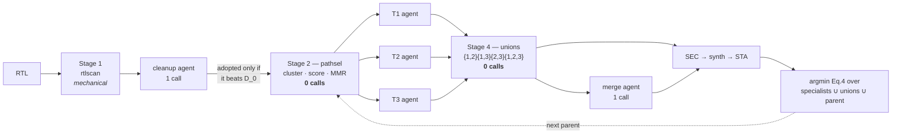
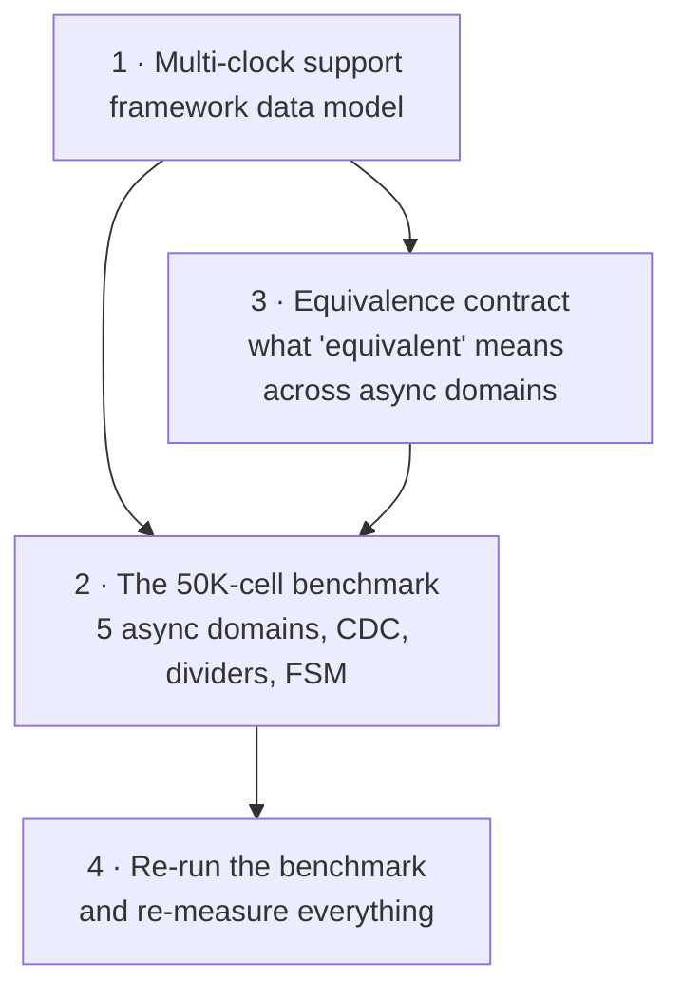

# HANDOFF — ASTRA path-portfolio addon

Context for whoever picks this up next, including me in a later session.

Branch `path-portfolio`, 8 commits ahead of `main`. 163 tests, all passing,
none needing an EDA install or a model. `make opt` is unchanged and tested to
be so.

---

## 1. What this repo is

A container (Yosys + OpenSTA + nangate45) with two closed-loop RTL timing
optimisers built on it.

**`make opt` — Dr. RTL.** The published loop: analyse the critical path, write
N rewrites in parallel, verify each for equivalence, keep the best by a scalar
PPA objective, learn from the group. Four roles kept strictly apart — the agent
that decides never runs a tool, the evaluator never interprets a report.

**`make portfolio` — the addon.** Same skeleton, three changes: a mechanical
selector picks *k disjoint* bottleneck targets instead of handing all N
candidates one shared analysis; one agent is scoped to each; their fixes are
recombined by text splicing before measurement picks the winner.



---

## 2. Files

| file | lines | what it owns |
|---|---|---|
| `tools/pathsel.py` | 943 | **the novelty** — cone clustering, criticality distribution, value scoring, MMR selection, path segmentation |
| `tools/portfolio.py` | 1181 | the addon orchestrator; subclasses `drrtl.Orchestrator` |
| `tools/rtlscan.py` | 738 | pre-synthesis structural smells, lexical (no elaboration) |
| `tools/merge.py` | 337 | order-independent mechanical union + conflict report |
| `tools/skillgen.py` | 436 | renders `SKILL.md`, routes sections per agent role |
| `tools/drrtl.py` | 1254 | base loop, four agents; **do not fork it, subclass it** |
| `tools/score.py` | 320 | Eq. 1/3/4/5, plus `sec_tally` |
| `tools/skills.py` | 555 | the confidence-weighted library |
| `tools/rtl_map.py` | 598 | path → RTL localisation, structural diagnosis |
| `tools/selftest.py` | 1600 | 163 tests, no EDA, no model |

Reuse rule: `portfolio.py` subclasses `drrtl.Orchestrator`, so evaluation, SEC,
scoring, skill learning, the trajectory log and the reply parsers all come
across unchanged. `drrtl.py` was changed only by three parameterisations (a
swappable system prompt and directive list, an explicit SEC gold, a run prefix)
and `rtl_map.py` by a `stage=` argument.

---

## 3. Measured results

Haiku, `mac_chain`, 2 ns target. Eq. 3 is relative to D_0; lower is better.
SEC counted over candidates that reached a verdict.

| run | iters | calls | ΔWNS | ΔTNS | Eq.3 | SEC |
|---|---|---|---|---|---|---|
| Dr. RTL | 3 | 18 | **+54.7 %** | +58.7 % | −0.4789 | 11/12 |
| portfolio | 2 | 11 | +53.5 % | +56.7 % | −0.4658 | 4/6 |
| portfolio (ext.) | 3 | 5 | +47.1 % | **+79.8 %** | **−0.5153** | 3/3 |
| portfolio, 1 iter | 1 | 6 | +52.8 % | +56.0 % | −0.4599 | 3/3 |
| portfolio, post-fix | 1 | 6 | +53.5 % | +56.7 % | −0.4658 | 3/3 |

**Read these carefully.** Three things are easy to over-claim:

- **Every run peaked at iteration 1.** No iteration 2 or 3 has improved on it
  in any portfolio run. The extended run's winning −0.5153 came from iteration
  1; its iterations 2 and 3 lost all six model calls to CLI failures. One early
  Opus run is the sole counterexample.
- **The merge agent has never earned its call.** Its measured delta against the
  free mechanical union is `+0.0000` on every run.
- **Cone selection has never fired.** Both shipped designs collapse to one cone,
  so every run so far exercised *segmentation*, not cone selection.

---

## 4. Defects already found and fixed

Each of these was the instrument being wrong, not the method. Worth reading
before trusting any number in a summary.

| defect | symptom | fix |
|---|---|---|
| SEC counted `passed/attempted` | a run where 6 of 9 model calls **died** reported "33 % SEC" when 3 of 3 real candidates passed | `score.sec_tally` counts over *decided*; both loops share it |
| library fragmented its evidence | one concept split into 4 entries at n=1–2, one keyed on a **verdict** (`"already attempted; insufficient margin"`); an agent declined a transformation whose own mean advantage was favourable | prefix token matching, containment alongside Jaccard, strategy floor, verdicts barred from founding an entry, `skills consolidate` |
| `criticality` gated on `slack < 0` | every target in a design that **meets** timing scored 0.0 and could not be ranked | `severity()`, monotone across zero, constraint at 0.5 |
| skill doc exceeded its budget | catalogue silently truncated away before any agent saw it | budget fits the document; per-role routing |
| segmentation ≠ RTL separability | with `--clean 0`, all 3 agents made the *same* edit; every hunk contested, union returned the parent | the pre-synthesis stage is what forces divergence — **do not disable it** |

**Process warning.** Two edits made via shell heredocs were written, verified
working, then reverted before staging — one commit's message described a change
its diff did not contain. Verify with `git show HEAD:<file>` after committing,
and prefer the edit tools over heredoc rewrites.

---

## 5. Objectives status

| # | objective | status |
|---|---|---|
| 1 | Analyze RTL against timing constraints | done |
| 2 | Identify critical paths and violations | done |
| 3 | GenAI recommends optimizations | **2 of 4** |
| 4 | Evaluate timing / area / performance | done |
| 5 | Formally verify equivalence | done *for single-clock designs* |
| 6 | Benchmark: 5 async domains, CDC, dividers, ~50K cells | **not started** |

Objective 3 detail: logic restructuring ✅, retiming ✅, **pipelining ✗**,
**FSM optimization ✗**.

Pipelining is *actively forbidden* — `drrtl.py:424`, `portfolio.py:169`,
`SKILL.md:26` all state "you may not add or remove a pipeline stage". That is
not an oversight: adding latency breaks the sequential-equivalence gate every
candidate passes through. Allowing it means changing the verification contract,
not editing a prompt.

FSM optimization has no testbed — **zero state machines** in any design — and
the skill document currently tells agents they are unreliable at it, on
published evidence.

---

## 6. The upcoming work

Three pieces, in dependency order. **(1) must come before (2)**, or the
benchmark cannot be measured correctly even once it exists.



### 6.1 Multi-clock support — do this first

The data model is **singular**. `config.json` carries one `clock` object with
one name and one period. Every site below assumes it:

| file:line | assumption |
|---|---|
| `astra.py:122-123` | `cfg["clock"]` defaults — one name, one period |
| `astra.py:207-210` | `@CLK_PERIOD@` substitutes **one** value into the SDC |
| `astra.py:228` | `ASTRA_CLK_PERIOD` → one env var |
| `astra.py:393,399` | `--period` overrides one clock; `metrics.json` records one |
| `drrtl.py:206,213,770,801` | same, in the orchestrator |
| `synth.tcl:22` | `abc -D $period_ps` — one delay target for the whole design |
| `sta_common.tcl:27,94` | `sta::worst_slack` — one WNS, one TNS, whole design |

**The trap.** `pathsel.severity()` (`pathsel.py:395`) divides slack by a single
`period_ns`, taken from `metrics.json`. With five domains, paths in four of them
would be normalised against the wrong period and **silently mis-ranked** — the
portfolio would pick wrong targets and report confident numbers while doing it.
This is the single highest-risk item in the whole change.

Minimum shape of the fix:

- `config.json`: `clocks: [{name, port, period_ns, generated_from?, divide_by?}]`,
  keeping `clock` as a one-element alias so existing designs and tests still load.
- SDC generation per clock rather than one `@CLK_PERIOD@` substitution.
- Per-clock-group WNS/TNS out of `sta_common.tcl`, and `parse_sta` to carry them.
- `severity()` and `score.norm_timing()` to take the period **of the path's own
  clock group** — `parse_sta` already captures `path_group` per path, so the
  information is there and is currently discarded.
- Yosys: one `abc -D` per clock is not expressible; decide whether to target the
  tightest, or partition. Document the choice.

### 6.2 The benchmark design

| requirement | required | today |
|---|---|---|
| independent master async clocks | 5 | 1 |
| generated clocks per master | ≥1 | 0 |
| clock domain crossings | yes | 0 |
| clock dividers, multiple ratios | yes | none |
| standard cells | ~50,000 | 7,343 (`mac_chain`) |

Also needs at least one **FSM**, or objective 3 stays at 2 of 4 with no way to
test the missing half.

Note the existing `designs/dual_path/` exists for a different reason — it is the
two-independent-cone testbed that objective-2 work needs, and it has **never
been synthesised**. It is not a substitute for the objective-6 benchmark.

### 6.3 The equivalence contract — decide before building 6.2

Two genuine problems, not engineering details:

**Async domains.** `eqy` and the Yosys miter both assume a common clock.
Cycle-by-cycle equivalence is not well-defined across genuinely asynchronous
domains. Options: per-domain SEC with CDC boundaries cut and constrained;
or bounded equivalence with `set_clock_groups -asynchronous` and an explicit
statement of what was *not* proven.

**Scale.** SEC already hit the 1800 s timeout on a **7,343-cell** design
(`--sec-timeout`, `drrtl.py:264`). At 50K cells with multiple domains, bounded
SEC will time out routinely. `sec_decided()` already keeps a timeout from being
recorded as a refutation — that distinction becomes load-bearing rather than a
nicety.

Objectives 5 and 6 are in tension: objective 5 works *because* the designs are
small and single-clock, and objective 6 removes both conditions.

**Also:** CDC paths must be excluded from setup analysis
(`set_clock_groups -asynchronous`), or every crossing appears as an enormous
violation and swamps the portfolio's TNS shares and criticality distribution.

---

## 7. Things that will bite you

- **Do not run with `--clean 0`.** The pre-synthesis stage takes the obvious fix
  off the table, which is what forces the specialists onto different
  bottlenecks. Without it they converge and the unions collapse to the parent.
- **Reset the skill library between benchmark arms** (`make clean-skills`). It
  persists across runs by design, so the second arm otherwise inherits what the
  first learned.
- **Match `--iters` across arms.** The loops ship different defaults now — 3 for
  `make opt`, 4 for `make portfolio` — so omitting it compares budgets, not
  methods.
- **`--dry-run` still needs the container.** It skips model calls, not the
  baseline synthesis.
- **CLI failures are the dominant confound.** `claude ... exit 1` with empty
  stderr has cost whole iterations. Check `not_generated` in the SEC tally
  before concluding anything about a run.

---

## 8. Navigating the code — graphify

The repo is indexed as a queryable code knowledge graph. Local AST parsing via
tree-sitter: no LLM, no network, no vector store, no API key.

```bash
graphify update .              # rebuild (seconds); regenerates graphify-out/
graphify explain "pathsel"     # a node, its neighbours, and why each edge exists
graphify path "portfolio.py" "score.py"    # shortest path between two nodes
```

Current index: **803 nodes, 1464 edges, 43 communities**, one per module. Line
numbers were spot-checked against the tree and are exact. `runs/` is not
indexed, so the 92 MB of run artifacts add no noise.

`graphify-out/` is **gitignored** — it is derived, ~1.5 MB, churns on every
edit, and rebuilds in seconds from source. `GRAPH_REPORT.md` inside it is worth
reading once: it lists the most-connected abstractions, import cycles (none),
and cross-module coupling.

The one structural finding worth carrying forward: every "surprising
connection" it reports is `pathsel.py → rtl_map.RtlIndex`. That is the addon's
single real coupling to the base flow, and it is the thing that would have to
move if `rtl_map` is reworked for multi-clock (§6.1).

Installed at `~/.local/share/graphify-venv`, linked into `~/.local/bin`. Note
`graphify install` also created a **global** `~/.claude/CLAUDE.md`, which
applies to every project on this machine, not just this repo.

## 9. Verify without tools or a model

```bash
python3 tools/selftest.py                    # 163 tests
python3 tools/pathsel.py runs/mac_chain/opt-20260901-025558-run1/baseline -k 3
python3 tools/rtlscan.py designs/mac_chain/rtl/mac_chain.v
python3 tools/skills.py consolidate          # repairs a fragmented library
make skilldoc                                # rebuild SKILL.md
```

The `pathsel` invocation is the acceptance check for the novelty: on the
committed artifact it must collapse 20 paths to **one cone** and cut three
segments matching the three bottlenecks `mac_chain/config.json` declares by
hand — without reading that field.

Report: `docs/astra-portfolio-report.tex` (LaTeX, uncompiled, TikZ diagrams).
Its results table predates the post-fix run and is one row short.
